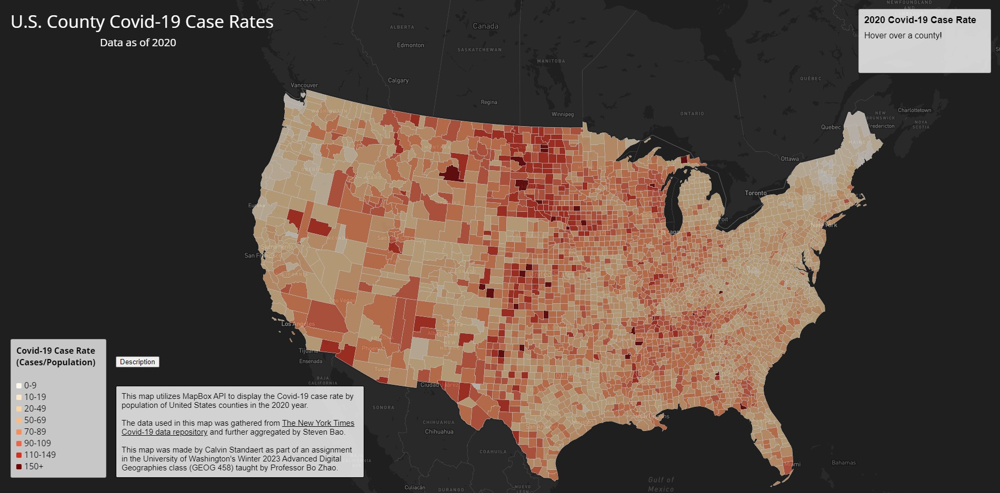
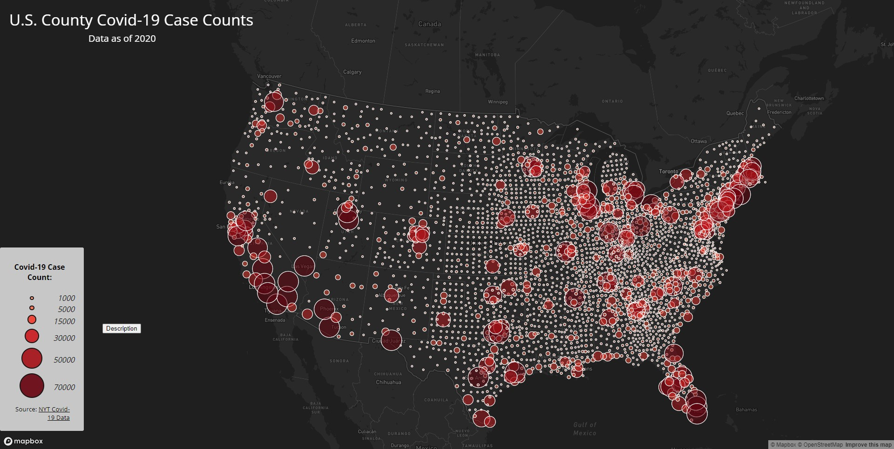

# Covid-19 Rate and Count Mapping
### Author: Calvin Standaert
#### Date: February 4th, 2023

## Background Information:

This project was made by Calvin Standaert as part of an assignment in the University of Washington's Winter 2023 Advanced Digital Geographies class (GEOG 458) taught by Professor Bo Zhao.

This project contains two separate web maps made using Mapbox API that display either the covid-19 case rate or case count of contiguous U.S. counties in the 2020 year. The code framework for each map was provided by Professor Bo Zhao, while the data used in both maps were drawn from The New York Times’ covid-19 data tracking repository and further modified for use by Steven Bao. Both maps solely focus on the 2020 covid-19 statistics of contiguous U.S. counties, whose geometries/boundaries in the maps were provided by the United States Census Bureau. Lastly, the two maps in this project utilize an Albers conical projection and are confined to the contiguous U.S. and its surrounding regions.

## Map 1: Mapping Covid-19 Case Rates

[Link to map](https://calvinuw.github.io/CalvinUW-Covid19-Mapping/map1.html)

The first map contained in this project is a choropleth wherein the rate of covid-19 cases per 1,000 individuals in a US county’s population in 2020 is represented. In addition to the covid-19 data provided by The New York Times, this map also uses population data drawn from the American Community Survey to calculate covid-19 case rates. The county covid-19 case rates in this map are depicted with a color gradient, where the color of a given county represents the severity of a county’s 2020 covid-19 infection rate. The color ranges from light yellow to dark red, with lower infection rates being colored light yellow and larger infection rates being colored darker red. Aside from the color alone, a county's rate of covid-19 cases is also provided in a box in the top right corner of the map, which indicates the covid-19 rate and state/county name for the county that the mouse is currently hovering over. Finally, the map also contains a legend in its lower lefthand portion that shows the numeric values and colors associated with each rate, along with a description button that displays the map’s background information when clicked.

## Map 2: Mapping Covid-19 Case Counts

[Link to map](https://calvinuw.github.io/CalvinUW-Covid19-Mapping/map2.html)

The second map contained in this project is a proportional symbol map, wherein the count of covid-19 cases for a given US county in 2020 is depicted with an appropriately sized and colored circle. More specifically, the circles used to represent the case count of a given county are sized proportionally to the number of covid-19 cases recorded in that county during 2020. The case count is further represented with color, where circles representing covid-19 case count of a county are colored lighter shades of red for low case counts and darker shades of red for high case counts. Aside from the size and color of symbols alone, the state, county, and case count of a symbol can be determined by an information box that appears when clicking upon a circle on the map. Finally, the map also contains a legend in its lower lefthand portion that shows the numeric values and colors associated with each count range, along with a description button that displays the map’s background information when clicked.

### Data Source:
[The New York Times - Covid-19 Data Repository](https://github.com/nytimes/covid-19-data/blob/43d32dde2f87bd4dafbb7d23f5d9e878124018b8/live/us-counties.csv)

[American Community Survey Population Data](https://data.census.gov/table?g=0100000US$050000&d=ACS+5-Year+Estimates+Data+Profiles&tid=ACSDP5Y2018.DP05&hidePreview=true)

[The United States Census Bureau County Boundaries](https://www.census.gov/geographies/mapping-files/time-series/geo/carto-boundary-file.html)

### Credit:

Professor Bo Zhao - Map Frameworks

[Steve Griffin - "Two pages one script" Youtube Video](https://www.youtube.com/watch?v=7_kaX07tVFc&ab_channel=SteveGriffith-Prof3ssorSt3v3 )
This video provided me with information on how to combine the javascript code of two different web pages into a single file.

[W3 School - Javascript button toggle tutorial](https://www.w3schools.com/howto/howto_js_toggle_hide_show.asp )
This tutorial was used as a guideline for creating an information box that appears/disappears when a button is clicked.

### Acknowledgments:

I would like to thank Professor Bo Zhao for providing the framework for creating both maps, and I would also like to thank my Teaching Assistant Steven Bao for his help in manipulating the data and his more general aid on coding this project.
